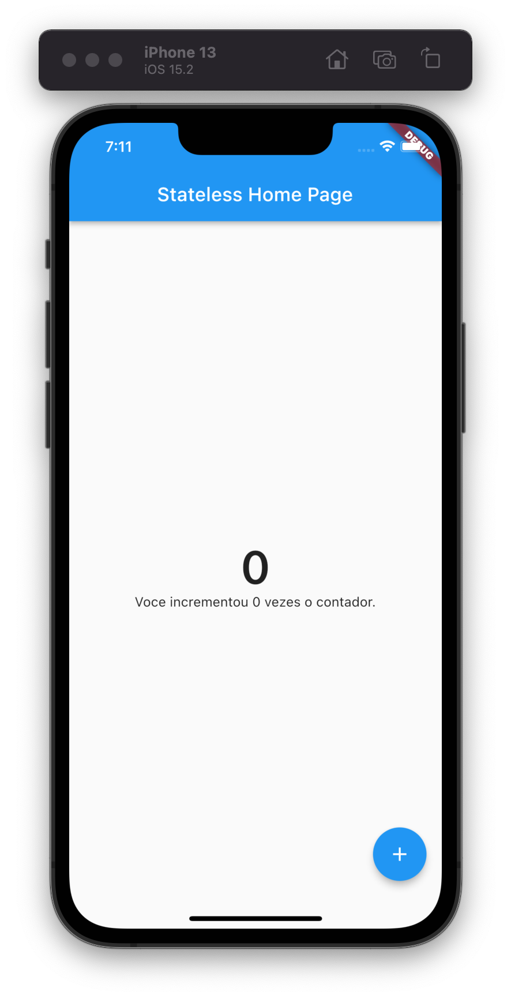
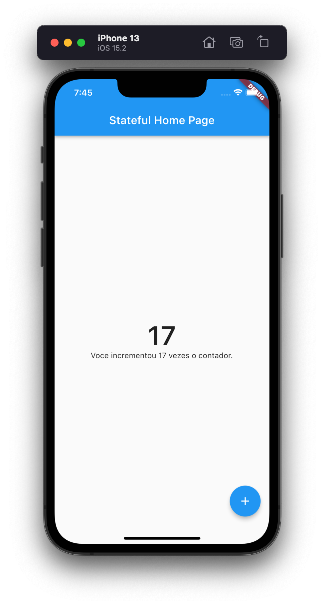

# f290_dsm_widgets_playground

## Parte I - Widgets Stateless e Statefull

Para este projeto iremos recriar o Projeto Counter, padrão para projetos Flutter para tal, iremos recriar a versão stateless e convertê-la para statefull.

> O objetivo deste projeto é compreender a diferença entre os widgets mutáveis e imutáveis.

## Siga os snipets abaixo para criar a versão stateless

A partir deste projetoiremos segmentar os arquivos dart visando uma melhor organização do projeto.

### Criando a base do projeto

1. Remova todo o código do arquivo `lib/main.dart`.
2. Importe o pacote `import 'package:flutter/material.dart';`;
3. Crie o diretório `lib/pages`.
3. Crie o Widget base do aplicativo incluido o código abaixo.

```dart
import 'package:flutter/material.dart';
import 'pages/contador_stateless.dart';

class MyApp extends StatelessWidget {
  const MyApp({super.key});

  @override
  Widget build(BuildContext context) {
    return MaterialApp(
      title: 'Flutter Demo',
      theme: ThemeData(
        primarySwatch: Colors.blue,
      ),

      //TODO: Criar arquivo contador_stateless.dart no diretório lib/pages
      home: const ContadorStateless(title: 'Stateless Home Page'),
    );
  }
}
```

### Criando o widget da tela inicial

1. No diretório `lib/pages` crie o arquivo `contador_stateless.dart`.
2. Nos trechos abaixo iremos criar um Stateless Widget no arquivo `contador_stateless.dart`.

> Criação da classe Dart

```dart
 //TODO: Conversão para Widget
class ContadorStateless {
 
}
```

> Extensão para StatelessWidget

```dart
class ContadorStateless extends StatelessWidget {
  //TODO: Implementação de método de construção
}
```

> Implementação do método build, o build é responsável pela contrução do componente visual.

```dart
class ContadorStateless extends StatelessWidget {
    //TODO: Criar atributos
    //TODO: Criar função de incremento
@override
  Widget build(BuildContext context) {
    //TODO: Implementar a representação de tela
    return Widget();
  }
}
```
3. Implementação do método build. 

> Iremos retornar no widget ContatorStateless a presentação de um tela no padrão Material Design com uma barra superior de aplicacão, corpo para exibição de informações e um botão de ação flutuante, o Widget Scaffold nos oferece estas funcionalidades.

```dart
@override
  Widget build(BuildContext context) {
    print('Execução do build!');
    return Scaffold(
      //TODO: Criar atributos para o nome do App para ser recebido pelo construtor da classe e armazenar o valor do contator
      appBar: AppBar(title: Text(title)),
      body: Center(
        child: Column(
          mainAxisSize: MainAxisSize.max,
          mainAxisAlignment: MainAxisAlignment.center,
          children: [
            Text(
              '$_counter',
            ),
            Text('Voce incrementou $_counter vezes o contador.'),
          ],
        ),
      ),
      floatingActionButton: FloatingActionButton(
        //TODO: Criar função de incremento
        onPressed: (){},
        child: const Icon(Icons.add),
      ),
    );
  }
```



4. Criar a função de incremento.

```dart
class ContadorStateless extends StatelessWidget {
  final String title;
  int _counter = 0;

  ContadorStateless({required this.title});

  _increment() {
    _counter++;
    print('Valor atual do contador $_counter');
  }

  //Método build abaixo...
}
```

5. Inclua a função de incremento ao FAB Button.

```dart
      floatingActionButton: FloatingActionButton(
        //Substituição da função de incremento
        onPressed: _increment,
        child: const Icon(Icons.add),
      ),
```

#### Teste o App

Ao executar o App e acionar o botão de incremeto, verifique a saída do console...

```
Performing hot restart...                                               
Restarted application in 792ms.
flutter: Execução do build!
flutter: Valor atual do contador 1
flutter: Valor atual do contador 2
flutter: Valor atual do contador 3
flutter: Valor atual do contador 4
flutter: Valor atual do contador 5
```

Note que o build foi executado 1 única vez e a tela permaceneu como foi criada, ou seja **IMUTÁVEL**, mesmo com o valor da variável `_counter` sendo alterado.

> Finalizamos a versão Stateless

## Siga os snipets abaixo para criar a versão statefull

Iremos criar a versão Statefull do contador, como você chegou até aqui, vamos simplificar o processo e focar apenas nos aspectos que o diferenciam da versão Stateless.

1. Crie o arquivo `lib/pages/contador_statefull.dart` e siga os passos abaixo:


> Criação da classe Dart

```dart
 //TODO: Conversão para Widget
class ContadorStatefull {
 
}
```

> Extensão para StatefulWidget

```dart
class ContadorStatefull extends StatefulWidget {
  @override
  State<StatefulWidget> createState() => _ContadorStatefullState();
}
```

> Implementação do método createState, o createState é responsável manutenção dos estados dos atributos e deve retornar um Widget que possua referencia dos seus estados e implementar o build.

```dart
class _ContadorStatefullState extends State<ContadorStatefull> {
  @override
  Widget build(BuildContext context) {
    return Placeholder();
  }
}
```

> Esta classe acima é classe que irá controlar a reconstrução da tela e atualizar os componentes com base nos estados de seus atributos.

> Abaixo temos a representação completa do nosso StatefulWidget

```dart
class ContadorStatefull extends StatefulWidget {
  final String title;

  const ContadorStatefull({required this.title});

  @override
  State<StatefulWidget> createState() => _ContadorStatefullState();
}

class _ContadorStatefullState extends State<ContadorStatefull> {
  int _counter = 0;

  _increment() {
    // Utilizamos o setState para notificar o framework que o estado de um atributo foi alterado e a tela precisa ser recriada.
    setState(() {
      _counter++;
    });
  }

  @override
  Widget build(BuildContext context) {
    return Scaffold(
      // Mudança no acesso ao atributo da classe, neste caso precisamos utilizar oprefixo widget
      appBar: AppBar(title: Text(widget.title)),
      body: Center(
        child: Column(
          mainAxisSize: MainAxisSize.max,
          mainAxisAlignment: MainAxisAlignment.center,
          children: [
            Text(
              '$_counter',
              style: const TextStyle(fontSize: 48, fontWeight: FontWeight.w600),
            ),
            Text('Voce incrementou $_counter vezes o contador.'),
          ],
        ),
      ),
      floatingActionButton: FloatingActionButton(
        onPressed: _increment,
        child: const Icon(Icons.add),
      ),
    );
  }
}
```

> Finalizamos a versão Stateful

## Teste o App

Mas antes, altere o widget do `MyApp` para o `ContadorStatefull`, altere também o título do App.



> Observe o log em console do App

```
An Observatory debugger and profiler on iPhone 13 is available at: http://127.0.0.1:52022/eHHy8rgy6Ug=/
flutter: Execução do build!
The Flutter DevTools debugger and profiler on iPhone 13 is available at:
http://127.0.0.1:9101?uri=http://127.0.0.1:52022/eHHy8rgy6Ug=/
flutter: Valor atual do contador 1
flutter: Execução do build!
flutter: Valor atual do contador 2
flutter: Execução do build!
flutter: Valor atual do contador 3
flutter: Execução do build!
flutter: Valor atual do contador 4
flutter: Execução do build!
```

> Observer que a cada vez que acionamos o FAB, um novo build é executado. 

### O próximo commit incluirei o custom widget que criamos no final da aula.
