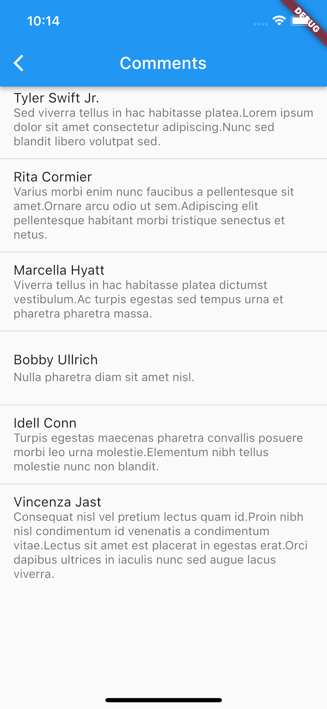

# f290_dsm_pdm2_navegacao_temas_ct

Neste tutorial iremos realizar a navegação entre telas utilizando named routes para facilitar o mapeamento unificado das rotas de navegação.

A navegação padrão em Flutter utiliza o conceito de pilha, ou seja o último a entrar é o primeiro a sair, posteriormente iremos estudar alternativas à este comportamento padrão porém, iremos utilizar o padrão neste tutorial.

> Iremos realizar a navegação nesta hierarquia de páginas.


## Crie o App Default

No arquivo `main.dart` adicione  a estrutura padrão do App.

```dart
import '../pages/second_page.dart';
import '../pages/third_page.dart';
import 'package:flutter/material.dart';
import 'pages/home_page.dart';

void main() {
  runApp(const App());
}

class App extends StatelessWidget {
  const App({super.key});

  @override
  Widget build(BuildContext context) {
    return MaterialApp(
      routes: {
        '/': (context) => const HomePage(),
        '/second': (context) => const SecondPage(),
        '/third': (context) => const ThirdPage(),
      },
    );
  }
}
```

> Os imports irão falhar, após criar as demais páginas; retorne e faça os imports

## Crie as demais páginas do App

1. Crie o arquivo `lib/pages/home_page.dart` e inclua o trecho abaixo.


```dart
class HomePage extends StatelessWidget {
  @override
  Widget build(BuildContext context) {
    return Scaffold(
      appBar: AppBar(
        title: const Text('Home Page'),
      ),
      body: SizedBox.expand(
        child: Column(
          mainAxisAlignment: MainAxisAlignment.spaceEvenly,
          crossAxisAlignment: CrossAxisAlignment.center,
          children: [
            FilledButton.icon(
              onPressed: () {
                // Navegação com rota nomeada para a segunda página
                Navigator.pushNamed(context, '/second');
              },
              icon: const Icon(Icons.arrow_forward),
              label: const Text('Ir para SecondPage'),
            ),
            FilledButton.icon(
              onPressed: () {
                // Navegação com rota nomeada para a terceira página
                Navigator.pushNamed(context, '/third');
              },
              icon: const Icon(Icons.arrow_forward),
              label: const Text('Ir para ThirdPage'),
            ),
          ],
        ),
      ),
    );
  }
}
```

2. Crie o arquivo `lib/pages/second_page.dart` e inclua o trecho abaixo.

```dart
class SecondPage extends StatelessWidget {
  @override
  Widget build(BuildContext context) {
    return Scaffold(
      appBar: AppBar(
        title: const Text('Second Page'),
      ),
      body: Center(
        child: Text(
          'Second Page!',
          style: Theme.of(context).textTheme.headlineLarge,
        ),
      ),
    );
  }
}
```

3. Crie o arquivo `lib/pages/third_page.dart` e inclua o trecho abaixo.

```dart
class ThirdPage extends StatelessWidget {
  @override
  Widget build(BuildContext context) {
    return Scaffold(
      appBar: AppBar(
        title: const Text('Third Page'),
      ),
      body: Center(
        child: Text(
          'Third Page!',
          style: Theme.of(context).textTheme.headlineLarge,
        ),
      ),
    );
  }
}
```

## Teste a navegação

Com o teste da navegação você perceberá que a rota para a home page foi criada automaticamemnte devido à pilha de navegação.

Teste a navegação para as 2 rotas, SecondPage e ThirdPage.

## Criando a navegação para uma página customizada de Feed

Neste trecho iremos criar a navegação para uma página de Feed conforme o modelo abaixo.


### Domain Model

Crie a classe de domínio para manipular os dados do Feed.

1. Crie a classe `lib/model/feed_model.dart`.
2. Importe a dependencia `intl` para realizarmos a formatação de números e datas e o conhecido `faker`.

```shell
flutter pub add intl faker
```

3. Adicione o código abaixo ao model.

```dart
import 'package:faker/faker.dart';
import 'package:intl/intl.dart';

class FeedModel {
  static final faker = Faker();

  int id = faker.randomGenerator.integer(200);
  String name = faker.person.name();
  String data = DateFormat.yMd()
      .add_jms()
      .format(faker.date.dateTime(maxYear: 2023, minYear: 2019));
  String lorem = faker.lorem.sentences(5).join(' ');
  String imageUrl =
      faker.image.image(width: 680, keywords: ['people'], random: true);

  // Geração de lista de comentários para a tela de detalhes
  List<Map<String, String>> comentarios = List.generate(
      faker.randomGenerator.integer(10, min: 1),
      (index) => {
            'user': faker.person.name(),
            'coment': faker.lorem
                .sentences(faker.randomGenerator.integer(5, min: 1))
                .join('')
          });
}
```

> Esta classe irá gerar um objeto que possua os dados para exibição no Feed.

### Widget Domain Model

Iremos criar agora o Widget para nossa domain class, este widget irá apresentar as informações conforme o objeto.

```dart
import 'package:flutter/material.dart';

import '../model/feed_model.dart';

class FeedItem extends StatelessWidget {
  const FeedItem({
    super.key,
    required this.feedModel,
  });

  final FeedModel feedModel;
  @override
  Widget build(BuildContext context) {
    return Column(
      children: [
        // Primeira seção: Dados do usuário - ListTile() -----------------------
        ListTile(
          leading: CircleAvatar(
            backgroundColor:
                Colors.primaries[feedModel.id % Colors.primaries.length],
            child: Text('${feedModel.id}'),
          ),
          title: Text(
            feedModel.name,
          ),
          subtitle: Text(feedModel.data),
        ),
        // Final ListTile ------------------------------------------------------

        // Segunda seção: Texto do Post - Text() -------------------------------
        Padding(padding: const EdgeInsets.fromLTRB(16, 8, 16, 16),
          child: Text(feedModel.lorem),
        ),
        // Final Text() --------------------------------------------------------

        // Terceira seção: Imagem do Post - Container() com imagem de fundo ----
        Container(
          height: 300,
          margin: const EdgeInsets.only(left: 16, right: 16),
          // Decoração avançada de container
          decoration: BoxDecoration(
            // Bordas arredondadas
            borderRadius: const BorderRadius.all(Radius.circular(16)),
            image: DecorationImage(
              // Ajuste de imagem com base na altura mantendo proporções
              fit: BoxFit.fitHeight,
              image: NetworkImage(feedModel.imageUrl),
            ),
          ),
        ),
        // Final Container()

        // Quarta seção: Barra de Açoes - ButtomBar() --------------------------
        ButtonBar(
          children: [
            TextButton.icon(
              onPressed: () {},
              icon: const Icon(Icons.favorite),
              label: const Text('Curtir'),
            ),
            TextButton.icon(
              onPressed: () {
                //TODO: Navegar para comentários
                Navigator.push(
                  context,
                  MaterialPageRoute(
                    builder: (context) => DetailPage(feedModel: feedModel),
                  ),
                );
              },
              icon: const Icon(Icons.chat_bubble),
              label: const Text('Comentar'),
            ),
          ],
        ),
        // Final ButtomBar()
      ],
    );
  }
}
```

> Terminamos nosso Widget, ele irá renderizar o itens do Feed dentro de um ListView.

### Criando o Widget com a lista de Widgets FeedItem

1. No widget `SecondPage`, adicione logo acima do método `build` o trecho abaixo.

```dart
static final List<FeedModel> feed = List.generate(10, (index) => FeedModel());
```
> Esta instrução irá criar 10 objetos FeedModel na lista feed, esta lista será o data source do SecondPage. Lembre-se que cada objeto FeedModel gera seus próprios dados; assim podermos enviar um objeto logo mais para a página de detalhes que iremos criar.

2. Altere o `body:` da `SecondPage` para o trecho abaixo.

```dart
ListView.separated(
  // Qauntidade de itens na ista
  itemCount: feed.length,  
  // Separador entre os itens da lista
  separatorBuilder: (context, index) => const Divider(
    height: 2,
    thickness: 2,
    indent: 16,
    endIndent: 16,
  ),
  // Widget criado a cada iteração da lista
  itemBuilder: (context, index) {
    return FeedItem(
      feedModel: feed[index],
    );
  },  
),
```

#### Confira o código completo da `SecondPage`.

```dart
import 'package:f290_dsm_pdm2_navegacao_temas/model/feed_model.dart';
import 'package:flutter/material.dart';

import 'feed_item_widget.dart';

class SecondPage extends StatelessWidget {
  const SecondPage({super.key});

  static final List<FeedModel> feed = List.generate(2, (index) => FeedModel());

  @override
  Widget build(BuildContext context) {
    return Scaffold(
      appBar: AppBar(
        title: const Text('SecondPage'),
      ),
      body: ListView.separated(
        itemBuilder: (context, index) {
          return FeedItem(
            feedModel: feed[index],
          );
        },
        separatorBuilder: (context, index) => const Divider(
          height: 2,
          thickness: 2,
          indent: 16,
          endIndent: 16,
        ),
        itemCount: feed.length,
      ),
    );
  }
}

```

### A página de detalhes com os comentários

Neste Widget iremos realizar a navegação passando dados entre as telas, iremos enviar os dados do item selecionado do Feed e exibir os comentários.

1. Crie o arquivo `lib/pages/detail_page.dart` e adicione o trecho abaixo.

```dart
import 'package:flutter/material.dart';

import '../model/feed_model.dart';

class DetailPage extends StatelessWidget {
  // Recebendo o objeto FeedModel pelo construtor
  const DetailPage({super.key, required this.feedModel});

  final FeedModel feedModel;

  @override
  Widget build(BuildContext context) {
    return Scaffold(
      appBar: AppBar(
        title: const Text('Comments'),
      ),

      // Gerando a lista de comentários com base na lista de comentários contidas no objeto
      body: ListView.separated(
        itemCount: feedModel.comentarios.length,
        itemBuilder: (context, index) => ListTile(
          title: Text(feedModel.comentarios[index]['user']!),
          subtitle: Text(feedModel.comentarios[index]['coment']!),
        ),

        // Separador
        separatorBuilder: (BuildContext context, int index) =>
            const Divider(height: 16, thickness: 1),
      ),
    );
  }
}

```

# Teste o App

Ao clicar no botão `Comentar` realizaremos a navegação para a `DetailPage` passando o objeto do Widget ao qual disparou o evento no botão.




## Concluímos
