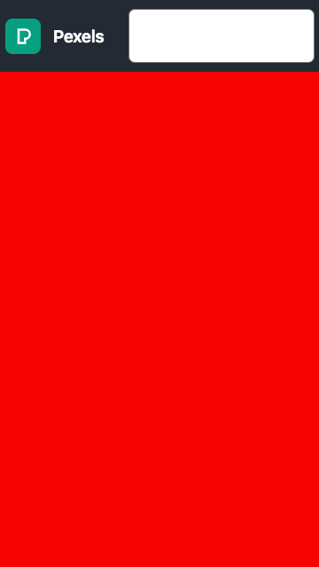

# f290_pexels_api

### Criação de projeto base
Como de praxe, crie um novo projeto `Flutter` indentificado por `f290_pexels_api`, e remova todo o código do arquivo `lib/main.dart`.

### Criar a interface de forma desacoplada
A partir deste projeto iremos desacoplar gradativamente o código da interface gráfica, melhorando a estrutura dos nossos projetos.

#### Criar arquivo para interface gráfica isolado
Vamos criar um pacote `lib/screens`, neste pacote iremos criar os arquivos/classes que irão compor as telas do App.

1. Selecione a pasta **lib** e crie o diretório screens, conforme a imagem abaixo.


2. Crie o arquivo `lib/screens/home_page.dart`, este arquivo representará a página principal do nosso App, em um arquivo separado.


#### Criando o StateFull Widget para a tela principal
1. Abra o arquivo `lib/screens/home_page.dart` e vamos começar a implementação a interface gráfica.

2. Importe o pacote Material

```javascript
import 'package:flutter/material.dart';
```
3. Crie o Statefull Widget `HomePage`.

```javascript
class HomePage extends StatefulWidget {
  @override
  _HomePageState createState() => _HomePageState();
}

class _HomePageState extends State<HomePage> {
  @override
  Widget build(BuildContext context) {
    return Container(

    );
  }
}
```

4. Adicione o `Scaffold` ao Widget com o `body` contendo uma **coluna** como base para o Layout.

```javascript
import 'package:flutter/material.dart';

class HomePage extends StatefulWidget {
  @override
  _HomePageState createState() => _HomePageState();
}

class _HomePageState extends State<HomePage> {
  @override
  Widget build(BuildContext context) {
    return Scaffold(
      appBar: AppBar(
        title: Text("Pexels Search"),
        backgroundColor: Color(0xFF232A34),        
      ),
      body: Column(
        mainAxisAlignment: MainAxisAlignment.center,
        children: <Widget>[
          Center(child: Text('Scaffold')),
        ],
      ),
    );
  }
}
```
#### Configurando o Widget Principal
Com a base da tela principal configurada, vamos configurar o nosso Widget principal e o método `main` para **orquestrar** a inicialização do App com as telas desacopladas.

1. Acesse o arquivo `lib/main.dart`, importe o pacote `Material` e crie o Widget `MyApp`, este deverá conter uma instancia de `MaterialApp` com uma referencia para composição com o Widget `HomePage` conforme o trecho abaixo.

```javascript
import 'package:f290_pexels_api/screens/home_page.dart';
import 'package:flutter/material.dart';

class MyApp extends StatelessWidget {
  @override
  Widget build(BuildContext context) {
    return MaterialApp(
      home: HomePage(),
    );
  }
}
```

2. Crie o método `main` como **trigger** do App. Não esqueça de importar o arquivo `home_page.dart`.

```javascript
import 'package:f290_pexels_api/screens/home_page.dart';
import 'package:flutter/material.dart';

main() => runApp(MyApp());

class MyApp extends StatelessWidget {
  @override
  Widget build(BuildContext context) {
    return MaterialApp(
      home: HomePage(),
    );
  }
}
```

Agora nosso código está mais limpo e organizado :stuck_out_tongue_winking_eye:

### Pexels API
O Pexels é um dos bancos de imagens mais populares e provê uma API para busca de imagens. Para podermos utilizá-la devemos nos cadastrar e obter uma chave de acesso para a utilizarmos em uma requisição web de busca.

1. Acesse a url `https://www.pexels.com/pt-br/api/`, realize o login e obtenha uma chave de acesso.


2. Anote sua chave de acesso e leia as instruções para uso da **Pexels API**.


Agora que você já viu como utilizar a API, vamos aprender como trabalhar com requisições web em **Flutter**.

## Trabalhando com requisições web em Flutter

### Obter o pacote HTTP
Para podermos realizar requisições web, precisamos importar uma biblioteca externa.
Para adicionar recursos externos, devemos acessar a url `https://pub.dev/flutter/packages` e realizar uma busca pelo pacote **http**.
Existem muitos pacotes e sempre que precisarmos de novas funcionalidades, este repositório será fundamental.

1. Realize a busca pelo pacote **http** na plataforma para familiarizar-se.


2. Adicione o trecho destacado acima ao arquivo `pubspec.yaml` logo abaixo do trecho  **cupertino_icons: ^0.1.3**.

```xml
cupertino_icons: 'latest'
http: 'latest'
```
3. Salve o arquivo `pubspec.yaml` para que os pacotes sejam baixados.

### Criar função para obter dados da API

Com o pacote **http** baixado, podemos criar funções **assícronas** para realizar requisições web e manipular o retorno de conteúdo das requisições.
1. Importe o pacote em `lib/screens/home_page.dart`.
```javascript
import 'package:http/http.dart' as http;
import 'dart:convert' as json;
```
2. Vamos fazer a sobrescrita do método `initState()`, método do ciclo de vida do Flutter, para ser executado quando a tela for criada ou inicializada.
```javascript
class _HomePageState extends State<HomePage> {

  @override
  void initState() async {
      super.initState();
    }
    //Restane do código...
}
```

3. Crie a função **assíncrona** para realizarmos uma requisição web de exemplo à API `pokeapi`. A função `obterDadosPokeAPI()` é **assícrona**, ou seja ela é executada em background em outra thread e quando ela concluir suas operações ela retornará os dados da requisição.
```javascript
obterDadosPokeAPI() async {
    http.Response response = await http.get('https://pokeapi.co/api/v2/pokemon/pikachu');
    print(response.body);
}
```
4. Adicione a chamada da função ao método `initState`.
```javascript
class HomePage extends StatefulWidget {
    @override
    _HomePageState createState() => _HomePageState();
  }

  class _HomePageState extends State<HomePage> {
    @override
    void initState() async {
        super.initState();
        obterDadosPokeAPI();
    }

    obterDadosPokeAPI() async {
      http.Response response = await http.get('https://pokeapi.co/api/v2/pokemon/pikachu');
      print(response.body);
    }
}
```

5. Execute o App e verifique os dados obtidos pela requisição no console.


6. Agora que vimos o resultado da consulta do ilustríssimo Pikachu, vamos criar uma requisição à Pexels API.
 Garanta que você tem a chave da API para prosseguirmos, pois a requisição do Pexels requer um `header Atuhorization` na requisição.

7. Altere a função `obterDadosPokeAPI()` para uma função privada com o tipo de retorno `Future`, por iremos receber os dados da requisição de forma assíncrona, não imediata e não bloqueante! Atualize o código conforme o trecho abaixo.

```javascript
class _HomePageState extends State<HomePage> {
  @override
  void initState() {
    super.initState();
    _getImages().then((value) => print(value));
  }

  static const String API_KEY = 'SUA_PEXELS_API_KEY_AQUI';

  // Url para buscar as melhores foto do dia
  final url = 'https://api.pexels.com/v1/curated?per_page=20&page=1';

  /* Metodo reponsavel por realizar requisicao web assincrona com a Pexels API
    O header Authorization foi adicionado ao parametro opcional nomeado [headers:{}]
    O modificado async torna o metodo assincrono.
    O modificador await faz com que a instrucao seja executada em background e continue po ponto atual ao concluir as tarefas.
  */
  Future _getImages() async {
    http.Response response = await http.get(url, headers: {
      HttpHeaders.authorizationHeader: API_KEY
    });

    // Neste trecho validados o statusCode da requisição, caso não haja problemas, retorna-se os dados da requisção em JSON
    if (response.statusCode == 200) {

      // O objeto json foi extraido da classe convert.dart, ele é responsável por realizar conversões para JSON.
      return json.jsonDecode(response.body);
    }else{
      print("Erro ao obte imagens. Status Code: ${response.statusCode}");
    }
  }


  // Restante do código aqui...
}
```

8. Execute o App e confira o resultado da requisição no console.
9. Você pode também executar uma requisição `https://api.pexels.com/v1/curated?per_page=20&page=1` no `Postman` para verificar o resultado; não esqueça de adicionar a API_KEY conforme a imagem abaixo.

10. Dados em mão; vamos criar a interface gráfica para exibir as imagens.

### Construir UI
Agora iremos construir a interface gráfica conforme o mockup abaixo.


#### Atualize o Scaffold

```javascript
@override
  Widget build(BuildContext context) {
    return Scaffold(
      backgroundColor: Color(0xFF232A34),
      body: SafeArea(
        child: Column(
          children: <Widget>[
            Container(
              color: Color(0xFF232A34),
              padding: EdgeInsets.all(5),
              child: Row(
                children: <Widget>[
                  Image.network(
                    'http://images.pexels.com/lib/api/pexels-white.png',
                    height: 35,
                    fit: BoxFit.fitHeight,
                  ),
                  Expanded(
                    child: Container(
                      margin: EdgeInsets.only(left: 16),
                      decoration: BoxDecoration(
                        color: Colors.white,
                        borderRadius: BorderRadius.circular(5),
                      ),
                      child: TextField(
                        decoration: InputDecoration(
                          fillColor: Colors.white,
                          border: OutlineInputBorder(
                            borderSide:
                                BorderSide(color: Colors.white, width: 1),
                          ),
                        ),
                      ),
                    ),
                  )
                ],
              ),
            ),
            Expanded(
              child: Container(
                color: Colors.red,
              ),
            ),
          ],
        ),
      ),
    );
  }
```
1. No trecho de código acima, adicionamos ao body do Scaffold:
* SafeArea
 * Column
   * Container
     * Row
       * ImageNetWork
       * Expanded
         * TextField
   * Expanded
     * Container

Utilizamos uma Column como base do Layout dividindo-o em duas seções; o primeiro Container contém uma Row com o Logo do Pexels e um Expanded com um TextField para ocupar o espaço disponível na Row.
Na segunda seção; iremos criar o GridView para exibir as imagens no lugar do Container vermelho no design atual, conforme o mockup abaixo.



#### Back To The Future
Vamos começar a tratar as requisições na interface gráfica ao invés do console; para tal, precisamos atualizar UI e adaptar nossa função `_getImages()`.


#### Utilizando o FutureBuilder

O Widget `FutureBuilder` tem a capacidade de trabalhar com requisições futuras, permitindo o devido tratamento dados futuros e do UI conforme veremos no trecho logo abaixo.
Na segunda seção, substitua o Container vermelho por um `FutureBuilder`, o trecho abaixo é o conteúdo do Expanded com o child FutureBuilder.


```javascript
Expanded(
  child: FutureBuilder(
      future: _getImages(),
      builder: (context, snapshot) {
        switch (snapshot.connectionState) {
          case ConnectionState.none:
          case ConnectionState.waiting:
            return Container(
              width: 200,
              height: 200,
              alignment: Alignment.center,
              child: Loading(
                indicator: BallPulseIndicator(),
                size: 200,
                color: Colors.white,
              ),
            );
          default:
            if (snapshot.hasError) {
              print('Erro: ${snapshot.error.toString()}');
            }else{
              return Container(color: Colors.green,);
            }
        }
      }),
)
```

No código acima o FutureBuilder após receber a resposta(snapshot) da requisição através do parâmetro **futures: _getImages()** os dados da requisição são recebidos pelo argumento **snapshot**.
O **builder** é responsável por construir o Widget que será retornado à seção;
O switch valida os estados da conexão e recebimento de dados; assim podemos definir o retorno apropriado para a UI.
Antes de executar o App, precisamos adicionar uma dependencia para facilitar a criação de um **Spinner** para ser exibido enquanto os dado são carregados.
#### Adicione o pacote Loading
No arquivo `pubspec.yaml` adicione a dependências abaixo logo abaixo de `cupertino_icons:`:
```shell
cupertino_icons: 'latest'
http: 'latest'
font_awesome_flutter: 'latest'
loading: 'latest'
```
Salve o arquivo ou digite no terminal
```shell
flutter pub add http font_awesome_flutter loading
flutter pub get 
```

#### Atualize os imports
No arquivo `home_page.dart`, atualize os imports no inicio do arquivo.

```shell
import 'dart:io';
import 'package:flutter/material.dart';
import 'package:font_awesome_flutter/font_awesome_flutter.dart';
import 'package:http/http.dart' as http;
import 'package:loading/indicator/ball_pulse_indicator.dart';
import 'dart:convert' as json;
```

Ao executar o App, acaso não haja conexão ou os dados estejam sendo carregados, uma animação será exibida. A animação paz parte do pacote `loading`.


Quando os dados forem recebidos e caso não ocorram erros, uma tela verde surgirá.


Agora que já temos o código responsável por gerenciar a conexão e o estado de carregamento, vamos implementar o Widget que deve ser exibido quando os dados forem carregados exibindo o **Grid** com as imagens.

#### Criando Widgets Customizados
A partir de agora podemos criar alguns Widgets customizados para deixar a arquitetura mais limpa e melhorar o gerenciamento e visualização do código. I

#### Criando o GridView
Vamos criar o `GridView` para exibir as imagens.
1. Adicione o método abaixo logo abaixo do `Scaffold`.

```javascript
Widget _createImageGrid(BuildContext context, AsyncSnapshot snapshot) {
      return GridView.builder(
        padding: EdgeInsets.only(top: 5, bottom: 10),
        gridDelegate: SliverGridDelegateWithFixedCrossAxisCount(
          crossAxisCount: 2,
          crossAxisSpacing: 5,
          mainAxisSpacing: 5,
        ),
        itemCount: _getCount(snapshot.data["photos"]),
        itemBuilder: (context, index) {
          return PexelsImage(data: snapshot.data, index: index);
        },
      );
  }
}
```

2. Adicione a função para retornar a quantidade de fotos à exibir.

```java
int _getCount(List data) {
  // O operador ?? valida se é nulo, caso contrário retorna um valor qualquer.
  return data.length ?? 0;
}
```

Este Widget receberá como argumento o **context** e um **AsyncSnapshot**, ou seja ele poderá acessar os dados da árvore de Widget e irá construir o grid com base nos dados já recebidos anteriormente, logo após o Spinner.
Os parametros **crossAxisCount**, **crossAxisSpacing** e **mainAxisSpacing** definem respectivamente a quantidade de colunas do grid, o espaçamento do eixo cruzado e eixo principal; **itemCount** a quantidade imagens no grid e o **itemBuilder** que é um `CallBack` responsável gerenciar a criação dinâmica de Widgets que irão compor o grid; dentro do callback iremos retornar a imagem; em nosso caso, iremos criar o Widget `PexelImage` que será alimentado pelo com base no índice snapshot de dados recebido por nossa requisição.

#### Criando o Widget PexelsImage
Com base no mockup precisamos criar ima imagem com um Label Translúcido com os cantos arredondados; para este caso em específico iremos precisar utilizar o Widget `Stack`, o Stack é um Widget em forma de pilha, literalmente; os elementos que estiverem abaixo na pilha serão exibidos primeiro, a principal característica do Stack é a sobreposição de elementos, então precisaremos de uma pilha contendo o label translúcido e a imagem mais recuada na pilha.

1. Vamos criar o Widget  `PexelsImage` do tipo StatelessWidget. Adicione o código abaixo no final do arquivo `home_page.dart`.
```javascript
class PexelsImage extends StatelessWidget {

  final Map data;
  final int index;

  PexelsImage({@required this.data, @required this.index});

  @override
  Widget build(BuildContext context) {
    return Stack(
      fit: StackFit.expand,
      children: [
        Image.network(
          data["photos"][index]["src"]["medium"],
          fit: BoxFit.cover,
          height: 300,
        ),
        //LabelImageData(data: data, index: index),
      ],
    );
  }
}
```
No Widget criamos dois atributos um Map data e um index; como estamos utilizando um StatelessWidget e não armazenamos estado,  os atributos devem ser final.
Iremos receber os dados por argumentos e montar a pilha com um `ImageNetwork` recuado e uma composição com o Widget `LabelImageData` sobreposto.
Este Widget irá receber a url da imagem contida na requisição web do Pexels API e irá exibi-la com 300px de altura máxima.

#### Teste o App! :point_right: :iphone:
Neste momento seu App deve ter esta aparencia com 40 imagens no grid!


#### Completando a Pilha
Vamos concluir o design do App e criar a camada superior do Stack.
1. Adicione o código abaixo.
```javascript
class LabelImageData extends StatelessWidget {
  const LabelImageData({@required this.data, @required this.index,});

  final Map data;
  final int index;

  @override
  Widget build(BuildContext context) {
    return Positioned(
      bottom: 0,
      left: 0,
      right: 0,
      child: Opacity(
        opacity: 0.5,
        child: Container(
          height: 30,
          color: Colors.black,
          child: Column(
            mainAxisAlignment: MainAxisAlignment.center,
            children: <Widget>[
              Text(
                "Fotografo: ${data["photos"][index]["photographer"]}",
                style: TextStyle(color: Colors.white, fontSize: 12),
                textAlign: TextAlign.left,
              ),
              Text(
                "ID Fotografo: ${data["photos"][index]["photographer_id"]}",
                style: TextStyle(color: Colors.white, fontSize: 8),
                textAlign: TextAlign.left,
              ),
            ],
          ),
        ),
      ),
    );
  }
}
```
O Widget `LabelImageData` é um container composto por uma coluna contendo 2 Widgets Text, porém este container é filho de um Widget Opacity que por sua vez é posicionado especificamente na parte inferior da pilha pelo Widget `Positioned`.
Ele também é StatelessWidget e por isso os dados que irão o compor são passados como argumento no construtor.

2. Descomente o trecho:

```javascript
class PexelsImage extends StatelessWidget {

  final Map data;
  final int index;

  PexelsImage({@required this.data, @required this.index});
  @override
  Widget build(BuildContext context) {
   return Stack(
     fit: StackFit.expand,
     children: [
       Image.network(
         data["photos"][index]["src"]["medium"],
         fit: BoxFit.cover,
         height: 300,
       ),
       LabelImageData(data: data, index: index),
     ],
   );
  }
}
```

#### Teste o App! :point_right: :iphone:
Este deve ser o resultado do App agora.
Aproveite e teste o scroll para conferir as 40 imagens! :sunglasses:


#### Finalizando o Mockup

Nosso Mockup incluia cantos arredondados nas imagens; então vamos adiciona-lo!
Vamos fazer com que a `Stack` seja um filho o Widget `ClipRRect`, sende este responsável por literalmente recortar o seu Widget child.

1. Selecione o `Stack` dentro de `PexelsImage` e pressione as teclas de atalho `CTRL` + `ALT` + `R` e selecione `Wrap with widget...`.


2. Insira o Widget `ClipRRect` e insira o atributo **borderRadius**.

```shell
borderRadius: BorderRadius.all(Radius.circular(10)),
```

3. Confira o código abaixo...

```javascript
class PexelsImage extends StatelessWidget {
  final Map data;
  final int index;

  PexelsImage({@required this.data, @required this.index});

  @override
  Widget build(BuildContext context) {
    return ClipRRect(
      borderRadius: BorderRadius.all(Radius.circular(10)),
      child: Stack(
        fit: StackFit.expand,
        children: [
          Image.network(
            data["photos"][index]["src"]["medium"],
            fit: BoxFit.cover,
            height: 300,
          ),
          LabelImageData(data: data, index: index),
        ],
      ),
    );
  }
}
```

#### Teste o App! :point_right: :iphone:
Este deve ser o resultado :scream:


### Implementar as buscas :mag_right:

Vamos atualizar a função para realizar buscas dentro da API.

1. Logo acima do Scaffold, atualize o código para realizar a requisição.

```javascript
import 'dart:io';

import 'package:flutter/material.dart';
import 'package:font_awesome_flutter/font_awesome_flutter.dart';
import 'package:http/http.dart' as http;
import 'package:loading/indicator/ball_pulse_indicator.dart';
import 'dart:convert' as json;

import 'package:loading/loading.dart';

class HomePage extends StatefulWidget {
  @override
  _HomePageState createState() => _HomePageState();
}

class _HomePageState extends State<HomePage> {
  static String _busca;

  @override
  void initState() {
    super.initState();
    _getImages().then((value) => print(value));
  }

  static const String API_KEY =
      'SUA_PEXELS_API_KEY_AQUI';

  /* Metodo reponsavel por realizar requisicao web assincrona com a Pexels API
    O header Authorization foi adicionado ao parametro opcional nomeado [headers:{}]
    O modificado async torna o metodo assincrono.
    O modificador await faz com que a instrucao seja executada em background e continue do ponto atual ao concluir as tarefas.
  */
  Future _getImages() async {
    // Url para buscar as melhores foto do dia
    final urlCuratedPhotos =
        'https://api.pexels.com/v1/curated?per_page=40&page=1';

    // Url para realizar buscas na API    
    final urlSearch =
        'https://api.pexels.com/v1/search?query=$_busca&per_page=40&page=1';

    /* Trecho valida estado da variacel _busca; como este método _getImages() está dentro de InitState;
      Sempre que a tela for redesenhada por uma chamada ao setState, a função será carregada.
      Então será validado o conteudo da requisicao; se estiver vazio as imagens do dia serao exibidas,
      se houver conteudo, será realizada uma busca pelo conteudo contido.
    */
    var url = _busca == null || _busca.isEmpty ? urlCuratedPhotos : urlSearch;

    http.Response response = await http
        .get(url, headers: {HttpHeaders.authorizationHeader: API_KEY});

    // Neste trecho validados o statusCode da requisição, caso não haja problemas, retorna-se os dados da requisção em JSON
    if (response.statusCode == 200) {
      // O objeto json foi extraido da classe convert.dart, ele é responsável por realizar conversões para JSON.
      return json.jsonDecode(response.body);
    } else {
      print("Erro ao obte imagens. Status Code: ${response.statusCode}");
    }
  }
  // Scaffold logo abaixo...
}
```
Após incluir as modificações acima, vamos adicionar o **CallBack** ao usuário terminar de inserir os termos de busca no `TextField`, uma consulta deve ser disparada à API.

1. Adicione o atributo `onSubmited` ao TextField, no Scaffold o localize.
```javascript
Expanded(
  child: Container(
    margin: EdgeInsets.only(left: 16),
    decoration: BoxDecoration(
      color: Colors.white,
      borderRadius: BorderRadius.circular(5),
    ),
    child: TextField(
      decoration: InputDecoration(
        fillColor: Colors.white,
        border: OutlineInputBorder(
          borderSide:
              BorderSide(color: Colors.white, width: 1),
        ),
      ),
      onSubmitted: (text) {
        setState(() {
          _busca = text;
        });
      },
    ),
  ),
)
```

Sempre que o `setState` é executado o Widget será redesenhado e uma nova busca realizada, pelo fato do atributo **_busca** conter valor, uma nova busca será realizada e novas imagens serão exibidas.

#### Teste o App! :point_right: :iphone:
Este deve ser o resultado :pizza:


#### Gran Finale, mas nem tanto...
Embora ainda tenhamos muitas coisa para fazer neste App como criar uma tela com detalhes do fotógrafo e/ou detalhes da fotografia selecionada, compartilhar as imagens, exibi-las de alta definição, abrir o perfil do fotógrafo, fazer paginação utilizando o scroll; vamos finalizar criando Widgets para preencher a tela quando uma pesquisa não retornar resultados. Mas atualizarei em breve este App para tal, então chegamos à reta final.

#### Criar o DeuRuimWidget :sob:

Este widget será utilizando quando as coisas não forem bem...
Por exemplo a pesquisa estiver sem resultados ou erro de conectividade durante a requisição.

1. Adicione o Widget abaixo.
```javascript
class DeuRuimWidget extends StatelessWidget {
    final String mensagem;
    final IconData icon;

    DeuRuimWidget({this.mensagem, this.icon});

    @override
    Widget build(BuildContext context) {
      return Column(
        mainAxisAlignment: MainAxisAlignment.center,
        children: <Widget>[
          Padding(
            padding: const EdgeInsets.fromLTRB(50, 0, 50, 0),
            child: Text(
              mensagem,
              style: TextStyle(color: Colors.white, fontSize: 24),
            ),
          ),
          SizedBox(
            height: 25,
          ),
          Icon(
            icon,
            color: Colors.green.shade500,
            size: 72,
          ),
        ],
      );
    }
}
```

2. Atualize o `FutureBuilder` para exibir o `DeuRuimWidget`. Altere o fluxo do `default` do swich case no **Scaffold**.
```javascript
Expanded(
    child: FutureBuilder(
        future: _getImages(),
        builder: (context, snapshot) {
          switch (snapshot.connectionState) {
            case ConnectionState.none:
            case ConnectionState.waiting:
              return Container(
                width: 200,
                height: 200,
                alignment: Alignment.center,
                child: Loading(
                  indicator: BallPulseIndicator(),
                  size: 200,
                  color: Colors.white,
                ),
              );
            default:
              if (snapshot.hasError) {
                return DeuRuimWidget(
                  mensagem: "Erro ao obter dados da API Pexels...",
                  icon: FontAwesomeIcons.exclamationTriangle,
                );
              } else if ((_getCount(snapshot.data['photos'])) == 0) {
                return DeuRuimWidget(
                  mensagem: "Nao encontramos resultados...",
                  icon: FontAwesomeIcons.sadCry,
                );
              } else {
                return Container(
                  color: Colors.white,
                  padding: EdgeInsets.only(left: 5, right: 5),
                  child: _createImageGrid(context, snapshot),
                );
              }
          }
        }),
  )
```

#### Resultado de busca sem resultado :grimacing:
Este é o resultado!


### Wheres Go From Here...

O próximo passo será a utilização de scroll com exeibição de mais resultados e a criação de uma segunda tela com detalhes de uma fotografia selecionada!

Até o próximo HowTo!
