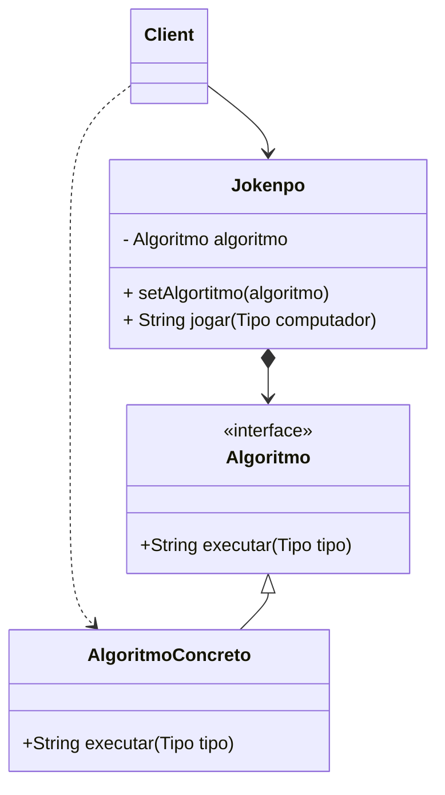

# JoKenPo

Implementação do algoritmo parcial com base no Padrão Strategy.

```mermaid
classDiagram

    Client --> Jokenpo
    Client ..> AlgoritmoConcreto
    Jokenpo *--> Algoritmo
    Algoritmo <|-- AlgoritmoConcreto


    class Client { }

    class Jokenpo {
        - Algoritmo algoritmo
        + setAlgortitmo(algoritmo)
        + String jogar(Tipo computador)
    }

    class Algoritmo {
        <<interface>>
        +String executar(Tipo tipo)
    }

    class AlgoritmoConcreto {
        +String executar(Tipo tipo)
    }

```